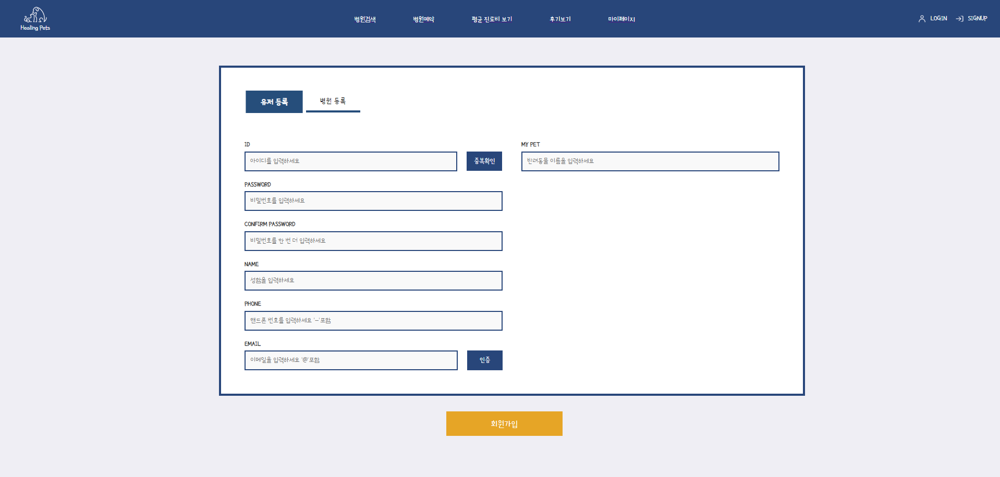

## 🗣️ 후기

>## 지동현
> - 소감
>  이번 프로젝트를 하면서 스프링 시큐리티, 엔티티, jwt 등에 대해서 폭넓은 이해를 할 수 있었다. Front에서는 리듀서로 리덕스 상태를 관리하여 api호출을 통해 데이터가 변경 또는 생성됨에 따라 리듀서 액션 함수를 통해 state 변경이 이루어져 자연스럽게 화면이 렌더링 될 수 있도록 했던 점에서 만족스러웠다. 그리고 Back에서 데이터를 불러오기 위해 Fetch 메서드 대신 Axios를 사용하여 기본적으로 request를 보낼때 헤더에 토큰을 담고 request body가 필요한 경우 파라미터에 담아 보낼 수 있도록 form을 생성하여 api를 좀 더 원활하게 호출할 수 있았던 것 같다.
>  
>- 아쉬운점
 사실 후회가 없을만큼 시간을 투자하기도 했고 제가 맡았던 태스크에 있어서는 코드에 대해 거의 모두 설명할 수 있을 정도로 이해도가 높았기 때문에 크게 아쉬운 점이 없었던 것 같습니다. 다만, 프로젝트 후반부에서 각자의 브랜치에서 작업한 것을 통합하는 과정에서 매끄럽게 반영이 되지 않아 당황스러웠습니다. 그래서 컴포넌트 스타일을 작성할 때  className을 더 구체적으로 작성한다던가 작업한 브랜치에서 한꺼번에 많은 내용을 한 커밋에 담기보다는 task를 구체적으로 나누어 여러번 커밋하는 해야하는 필요성을 느낄 수 있게 된 것 같습니다.

 

>## 박성은 
> - 소감
>  처음으로 제대로 진행한 프로젝트였고 프로젝트를 기획하고 설계하는 과정에서 팀원들과의 소통이 잘 이루어진 것 같아 프로젝트 진행 동안 큰 문제없이 프로젝트를 마칠 수 있었던 것 같다. 팀원 전부 서로 의견을 내며 프로젝트에 적극적으로 임하며 맡은 일을 해내는 모습이 팀워크가 좋다고 느꼈다. 프론트와 백을 연동하는 과정에서 어려움이 많았지만 시작 전에는 어떻게 연동이 되는 건가 하고 막막했지만 이제는 그 흐름을 알 수 있게 되었고 어떤 방향으로 진행되는지도 더 확실하게 이해할 수 있는 시간이었다. 
>  
>- 개선할 점 및 아쉬운 점
 연관된 리듀서들은 통합해서 관리하지 않으면 데이터 흐름을 추적하고 유지하는데 어려움이 생길 수 있고 한 리듀서의 상태 변화가 다른 리듀서에 영향을 줄 경우,  관리하는 것이 더 어렵다. 또한, 각 모듈이 분리되어 있으면 팀원들이 관련된 상태나 로직을 찾는 데 혼란을 겪을 수 있다는 것을 이미 각각의 리듀서를 만들고 마무리한 상태에서 알게 되어 계속 오류가 생기고 어려움이 많아서 처음에 잘 모르고 만든 것을 후회했다. 또한 필요한 내용들이 다 다른데 DTO를 새로 만들지 않고 팀원들끼리 서로 쓰다보니 계속 오류가 나고 되던 기능이 안 되는 게 계속 보여서 아쉬웠다.

>## 박효찬 
> - 소감
>  실제로 이런 프로젝트를 하게 되면서 어떻게 작업을 해야 하는지 작업 방향성에 대해 알 수 있어고, 실제로 작업하다
        여러 문제들이 발생했는데 이런것들을 해결하는 과정이 좋았고, 구현하는 기간이 부족해서 자신이 원하는 
        기능을  제대로 구현하지 못한점, 발표 전날에 종합하는 과정에서 오류가 발생해 각자 만들었던
        기능이 제대로 수행하지 못해서 늦게 까지 남아서 수정했던 이런 과정들이 한편으로는 아쉬었지만 다른 한편으로는
        이러한 경험을 해서 나중에는 어떻게 작업해야 할지 개선할 수 있는 경험을 했던거 같습니다.
>  
>- 개선할 점 및 아쉬운 점
 백에서 작업할 때 조회, 생성 ,수정 기능별로 DTO를 생성하는데 이걸 하나의 폴더로 생성해서 어떤 
        기능의 어떤 DTO를 써야 하는지 한눈에 파악하기 힘들었다.
               작업을 할 때 주석을 처리해서 어떤 기능을 수행하는지 명시 했지만 이걸 동작 순서로 정리하면 
               쉽게 파악 할 수 있었는데 그것을 못한점, 
       프론트에서 이미지 파일을 올려서 서버에 저장하려고 할 때 딜레이가 걸려서 실제로 프로트에서
               이미지를 조회할려고 하면 시간이 거렸다.
               여러사람들이 공통된 기능에서 작업을 하다보니 실제로 종합하는 과정에서 자신은 백에서 이렇게 
               적용했는데 다른사람은 다르게 작성해서 기능이 작동하지 못한 문제가 발생했다.

 

>## 김은혜 
> - 소감
>  세미 프로젝트를 진행하며 여러가지 기능을 새롭게 사용해볼 수 있어서 좋았고, 팀 단합이 잘 돼 끝까지 포기하지 않고 프로젝트를 완수할 수 있어서 감사했다. 
useSelector를 사용하며 리엑트 리덕스에 대해 조금 더 알게 됐고, chat gpt를 복사 붙여넣기 하는 것에서 넘어 코드의 흐름을 보게 됐다. 
브랜치 규칙을 잘 지켜, 오류가 발생했을 때 돌아가서 다시 확인할 수 있어서 좋았지만, 각자의 작업영역에 필요한 부분에 맞게 DTO, service, controller를 변경하는 작업에서 세밀한 소통이 이루어지지 않았고, 내 작업에 맞게 새로운 작업영역을 설정하지 않고 메인을 변경하다 보니 많은 충돌이 발생했다. 
앞으로 작업할 때에는 나와 동일하게 작업 영역을 사용하는 팀원과 세밀하게 소통하며 각자의 작업에 맞는 작업 영역 설정을 새롭게 해줘야겠다고 생각했다. 
끝까지 많은 오류가 발생해 당황했지만, 어느 부분에 오류가 발생하는지 확인하고 함께 고쳐나가는 작업을 통해 끝까지 프로젝트에 몰입하며 완성해나가는 부분에 매력을 알게된 것 같다.
 

## 두근두근 청춘 대학교 커뮤니티 웹 스크린 구성 및 기능

| **Home(ADMIN)** |  **Home(HospitalADMIN)**  |  **Home(User)** |
| :---:|:---:|:---:|
|  |  |  |

| **로그인** |  **회원가입**  |  **병원관리자-일정관리** |
| :---:|:---:|:---:|
|  |  |  |

| **병원검색** |  **병원예약**  |  **MyPage** |
| :---:|:---:|:---:|
|  |  |  |
